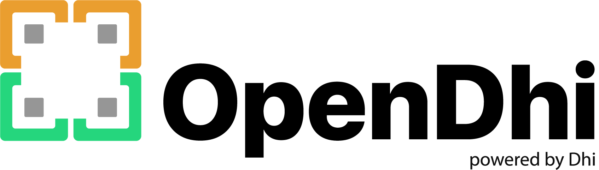

# Agent Mode — Contract Creation Journey (Implementation Spec)

This document reproduces, **exactly**, the changes from the commit `agent mode contract journey`
on the OpenDhi executive-layer mockup (vanilla HTML/CSS/JS, no build step).

Apply every edit verbatim — the code blocks are extracted byte-for-byte from the final files.
Files touched: `index.html`, `js/core.js`, `js/pages.js`, `css/main.css`.

## What this delivers

1. **My Tasks — requester profiles.** Every request row (Entity Admin & Super Admin "My Tasks"
   views) shows *who* sent the request: an initials avatar + full name + role, resolved from the
   `requestedBy` string (persona label like "HR" → the persona's real name; "Name (Role)" strings
   are parsed; anything else falls back to derived initials).
2. **Agent Mode chat journey.** In the header's Agent Mode, typing
   `create a contract for <Name> for <Country>` (e.g. *"create a contract for Virat Kohli for USA"*)
   runs the Contract Creation journey live:
   - **Chat (left)** narrates every step; **panel (right)** shows a two-phase timeline
     (**PREPARATION** → **JOURNEY · CONTRACT CREATION**) with a progress bar.
   - Preparation steps: *Setting up the agent → Checking for <Name> in your system → Found the
     employee in Keka → (Checking the document you shared, only if a file was attached) → Fetching
     the details → Checking for the right agent for this role* (renders an agent-comparison card:
     Contractor Agent "✓ Best match" vs Payroll Agent "Not needed here"). Once the journey phase
     starts, preparation collapses into a one-line green summary card (click to expand/collapse).
   - Each working step ticks through short activity phrases ("Querying the Employee Directory…"),
     then **reveals its captured fields one at a time (~420 ms apart)** — a labeled chip lands in
     the step card and the matching field **flashes amber** in a live **Contract Preview** document
     (letterhead, rotating corner stamp Draft → Sent for Signature → Signed, signature lines).
   - **Governance:** steps chipped `Human Required` pause the run. Since no approver is
     configured, the card shows a warning + a persona dropdown ("Assign approver & continue"),
     then a **"Simulate approval as <FirstName>"** button; approving logs it in chat, reveals
     Approver Name/Timestamp chips, and resumes.
   - **Completion:** success banner + **"View in Contracts →"** button + stat tiles
     (*N steps automated · N human approvals · N fields captured*). The run inserts a real row at
     the **top of `contractsData`**, so the Contracts page shows it at **S.No 1**.
3. **Chat attachments.** "+ → Upload File" in the Agent Mode input opens a file picker; the file
   shows as a removable chip above the input, then renders inside the sent user bubble (image
   thumbnail or 📎 filename).
4. **Contracts listing fix.** The S.No column shows display order (`index+1`) instead of the raw
   record id, so the newly inserted contract reads "1".

---

## 1. `index.html` — hidden file input

Insert **before** the `<script src="js/core.js"></script>` line (after the closing `</div>` of
`#v-agent-active`):

````html
<input type="file" id="agent-upload-input" accept="image/*,.pdf" style="display:none" onchange="handleAgentUpload(event)">
````

---

## 2. `js/core.js`

### 2.1 State (insert after the line `let aiH2rAnimatedStage=-1,aiH2rData={},aiH2rOffboardStep=-1;`)

````js
// -- Agent Mode: chat-driven journey run (typed prompt -> live journey execution in form-col) --
let pendingAgentAttachment=null,agentUploadTargetId=null,agentRunData=null;
````

### 2.2 Requester profile helpers (insert immediately after the `getActivePersona` function)

````js
function personaByLabel(label){return enterprisePersonas.find(function(p){return p.label===label;});}
// -- Resolve a "requestedBy" string (e.g. "HR" or "Priya Nair (Entity Admin)") into a displayable profile --
function requesterProfile(requestedBy){
  const persona=personaByLabel(requestedBy);
  if(persona)return{initials:persona.initials,name:persona.name,role:persona.label};
  const m=/^(.+?)\s*\((.+)\)$/.exec(requestedBy||'');
  const name=m?m[1]:(requestedBy||'Unknown');
  const role=m?m[2]:'';
  const initials=name.split(/\s+/).filter(Boolean).map(function(w){return w[0];}).join('').slice(0,2).toUpperCase()||'?';
  return{initials:initials,name:name,role:role};
}
function activePersonaJourneyIds(){return (getActivePersona().journeys||[]).slice();}
````

### 2.3 Replace the entire `buildInput(id,ph)` function

Changes vs. the original: an attachment chip is prepended when `pendingAgentAttachment` is set,
and the "Upload File" dropdown item gets `onclick="triggerAgentUpload('${id}')"`. Full replacement:

````js
// -- INPUT BAR BUILDER --
function buildInput(id,ph){
  const el=document.getElementById(id);
  const attachChip=pendingAgentAttachment?(`<div class="agrun-attach-chip">${pendingAgentAttachment.isImage?``:'<span class="agrun-attach-file-ic">&#128206;</span>'}<span class="agrun-attach-name">${pendingAgentAttachment.name}</span><button type="button" class="agrun-attach-remove" onclick="clearPendingAgentAttachment('${id}')" title="Remove attachment">&times;</button></div>`):'';
  el.innerHTML=attachChip+`<div class="input-row">
    <div class="icon-btn" onclick="togglePlus('${id}')" style="position:relative"><svg width="16" height="16" viewBox="0 0 24 24" fill="none" stroke="currentColor" stroke-width="2.5"><line x1="12" y1="5" x2="12" y2="19"/><line x1="5" y1="12" x2="19" y2="12"/></svg>
      <div class="plus-dd" id="pdd-${id}">
        <div class="plus-dd-item" onclick="triggerAgentUpload('${id}')"><svg viewBox="0 0 24 24" fill="none" stroke="currentColor" stroke-width="2"><path d="M21 15v4a2 2 0 0 1-2 2H5a2 2 0 0 1-2-2v-4"/><polyline points="17 8 12 3 7 8"/><line x1="12" y1="3" x2="12" y2="15"/></svg> Upload File</div>
        <div class="plus-dd-item"><svg viewBox="0 0 24 24" fill="none" stroke="currentColor" stroke-width="2"><path d="M10 13a5 5 0 0 0 7.54.54l3-3a5 5 0 0 0-7.07-7.07l-1.72 1.71"/><path d="M14 11a5 5 0 0 0-7.54-.54l-3 3a5 5 0 0 0 7.07 7.07l1.71-1.71"/></svg> Share Link</div>
        <div class="plus-dd-item"><svg viewBox="0 0 24 24" fill="none" stroke="currentColor" stroke-width="2"><path d="M15 7h3a5 5 0 0 1 5 5 5 5 0 0 1-5 5h-3m-6 0H6a5 5 0 0 1-5-5 5 5 0 0 1 5-5h3"/><line x1="8" y1="12" x2="16" y2="12"/></svg> Add URL</div>
      </div>
    </div>
    <input class="input-field" placeholder="${ph||'Ask anything or describe what you need...'}" onkeydown="if(event.key==='Enter')sendMsg('${id}')">
    <div style="position:relative">
      <div class="agent-sel" onclick="toggleAgent('${id}')"><svg class="agent-sp-icon" width="13" height="13" viewBox="0 0 24 24" fill="var(--orange)" stroke="none"><path d="M12 2L14.5 9.5L22 12L14.5 14.5L12 22L9.5 14.5L2 12L9.5 9.5L12 2Z"/></svg><span class="agent-sel-dot" style="width:5px;height:5px;border-radius:50%;background:${agent==='contractor'?'var(--green)':'var(--gray)'};flex-shrink:0"></span><span class="agent-label">${agent==='contractor'?'Contractor Agent':'Payroll Agent'}</span><svg width="12" height="12" viewBox="0 0 24 24" fill="none" stroke="currentColor" stroke-width="2.5"><polyline points="6 9 12 15 18 9"/></svg></div>
      <div class="agent-dd" id="add-${id}">
        <div class="agent-dd-hdr">Select Agent</div>
        <div class="agent-dd-item ${agent==='contractor'?'active':''}" onclick="pickAgent('contractor','${id}')"><span style="width:6px;height:6px;border-radius:50%;background:var(--green)"></span><div><div class="nm">Contractor Agent</div><div class="desc">Contracts, onboarding & compliance</div></div>${agent==='contractor'?'<span style="margin-left:auto;color:var(--orange);font-weight:700">&#10003;</span>':''}</div>
        <div class="agent-dd-item disabled"><span style="width:6px;height:6px;border-radius:50%;background:var(--gray)"></span><div><div class="nm">Payroll Agent</div><div class="desc">Salary, deductions & payslips</div></div><span class="coming-tag">Coming Soon</span></div>
      </div>
    </div>
    <button class="icon-btn" onclick="sendMsg('${id}')"><svg width="18" height="18" viewBox="0 0 24 24" fill="none" stroke="currentColor" stroke-width="2"><line x1="22" y1="2" x2="11" y2="13"/><polygon points="22 2 15 22 11 13 2 9 22 2"/></svg></button>
  </div>`;
}
````

### 2.4 Upload handlers (insert after `rebuildInputs()`, before the RENDER CHAT section)

````js
// -- Agent Mode: file attach (shown as a chip in the input bar, then carried into the sent chat message) --
function triggerAgentUpload(id){agentUploadTargetId=id;const inp=document.getElementById('agent-upload-input');if(!inp)return;inp.value='';inp.click();}
function handleAgentUpload(e){
  const file=e.target.files&&e.target.files[0];if(!file)return;
  const isImage=file.type.indexOf('image/')===0;
  const reader=new FileReader();
  reader.onload=function(ev){
    pendingAgentAttachment={name:file.name,dataUrl:ev.target.result,isImage:isImage};
    if(agentUploadTargetId)buildInput(agentUploadTargetId);
  };
  reader.readAsDataURL(file);
}
function clearPendingAgentAttachment(id){pendingAgentAttachment=null;buildInput(id);}
````

### 2.5 Replace the entire `renderChat(area,msgs)` function

(Adds attachment rendering inside bubbles — image thumbnail or 📎 file row, with the text below.)

````js
function renderChat(area,msgs){
  const el=document.getElementById(area);el.innerHTML='';
  msgs.forEach(m=>{const r=document.createElement('div');r.className='msg-row '+(m.role==='user'?'user':'');
    if(m.role==='bot')r.innerHTML=`<div class="bot-av"><svg width="12" height="12" viewBox="0 0 24 24" fill="var(--orange)" stroke="none"><path d="M12 2L14.5 9.5L22 12L14.5 14.5L12 22L9.5 14.5L2 12L9.5 9.5L12 2Z"/></svg></div>`;
    const b=document.createElement('div');b.className='bubble '+(m.role==='user'?'user':'bot');
    let inner=m.attachment?(m.attachment.isImage?``:`<div class="msg-attachment-file">&#128206; ${m.attachment.name}</div>`):'';
    inner+=m.text?`<div${m.attachment?' style="margin-top:6px"':''}>${m.text}</div>`:'';
    b.innerHTML=inner;r.appendChild(b);
    if(m.role==='user')r.innerHTML+=`<div class="user-av">PP</div>`;
    el.appendChild(r);
  });el.scrollTop=el.scrollHeight;
}
````

### 2.6 Replace the `closeAgent()` one-liner

````js
function closeAgent(){stopAmThreeJS();hideAgentWorkspaceButton();agentRunData=null;pendingAgentAttachment=null;showView('adt');renderADTPage();}
````

### 2.7 Replace the entire `sendMsg(id)` function

(Routes `create a contract for X for Y` prompts into `agentRunStart`, allows attachment-only
sends, carries the pending attachment onto the user message, and keeps the run panel from being
overwritten by `showWorkspaceEmpty()` while a run is active.)

````js
function sendMsg(id){
  const inp=document.querySelector('#'+id+' .input-field');const t=inp.value.trim();
  if(!t&&!pendingAgentAttachment)return;
  inp.value='';
  if(view==='agent-empty'||view==='agent-active'){
    const contractReq=parseAgentContractPrompt(t);
    const attachment=pendingAgentAttachment;pendingAgentAttachment=null;
    const startsContract=!contractReq&&isNetherlandsContractRequest(t);
    const userMsg={role:'user',text:t};if(attachment)userMsg.attachment=attachment;
    agentMsgs.push(userMsg);
    if(view==='agent-empty'){stopAmThreeJS();showView('agent-active');buildTopbar('agent-topbar-active','agent');buildSidebar('agent-sb',agentSidebarCollapsed,page);buildInput('inp-active');if(formStep<0&&!agentRunData)showWorkspaceEmpty();}
    else{buildInput(id);if(formStep<0&&!agentRunData)showWorkspaceEmpty();}
    renderChat('agent-chat',agentMsgs);showTyping('agent-chat');
    setTimeout(()=>{hideTyping();
      if(contractReq){agentRunStart(contractReq.name,contractReq.country,attachment);}
      else if(startsContract){agentMsgs.push({role:'bot',text:"Great! I'll open the Netherlands contract workspace now."});startNetherlandsContract();}
      else{var reply=agentReply(t);if(reply){agentMsgs.push({role:'bot',text:reply});if(formStep<0&&!agentRunData)showWorkspaceEmpty();}}
      renderChat('agent-chat',agentMsgs);
    },1000);
  }
}
````

---

## 3. `js/pages.js`

### 3.1 Contracts listing — S.No shows display order

In `buildContractsListingHTML()`, change the row map to expose the index:

````js
// before:
const rows=filteredContracts.map(c=>{
// after:
const rows=filteredContracts.map((c,ctIdx)=>{
````

…and change the first `<td>` of the row from `+c.id+` to `+(ctIdx+1)+`:

````js
    return '<tr class="ct-row'+(ctSelectedId===c.id?' lp-row-selected':'')+'" id="ct-row-'+c.id+'" style="cursor:pointer" onclick="openCtSidebar('+c.id+')">'
      +'<td style="color:#6b7280;font-size:13px">'+(ctIdx+1)+'</td>'
````

### 3.2 Agent Mode run engine (one contiguous block)

Insert this **entire block** immediately **before** the line
`// -- AI CONTRACT ASSISTANT (Contracts "+" flow, gated on the contract-creation journey being Active) --`.

It is self-contained and only depends on existing globals/helpers:
`aiJourneyEvents`, `enterprisePersonas`, `contractsData`, `agentMsgs`, `agentRunData` (§2.1),
`renderChat`, `showTyping`/`hideTyping`, `aiChipsCompact`, `aiAgentBadgeHTML`, `closeAgent`,
`navigatePage`.

````js
// -- AGENT MODE: chat-driven journey run — typed prompt ("create a contract for X for Y") plays out the
// Contract Creation journey (aiJourneyEvents['contract-creation']) live in the form-col, narrated in the chat. --
function parseAgentContractPrompt(text){
  const m=/create\s+(?:a\s+)?contract\s+for\s+([a-z][a-z .'-]*?)\s+(?:for|in)\s+([a-z][a-z .'-]+?)[.?!]*$/i.exec(String(text||'').trim());
  if(!m)return null;
  const name=m[1].trim().split(/\s+/).map(function(w){return w.charAt(0).toUpperCase()+w.slice(1).toLowerCase();}).join(' ');
  const countryAliases={usa:'United States',us:'United States','united states':'United States','united states of america':'United States',uk:'United Kingdom','united kingdom':'United Kingdom',uae:'UAE'};
  const rawCountry=m[2].trim();
  const country=countryAliases[rawCountry.toLowerCase()]||rawCountry.split(/\s+/).map(function(w){return w.charAt(0).toUpperCase()+w.slice(1).toLowerCase();}).join(' ');
  return {name:name,country:country};
}
const AGENT_RUN_SETUP_ACTIVITIES={
  init:['Spinning up the Contractor Agent workspace&hellip;','Loading journey definitions&hellip;'],
  lookup:['Querying the Employee Directory&hellip;','Cross-referencing Keka HRMS &amp; SAP S/4HANA&hellip;'],
  found:['Matching employee profile&hellip;','Verifying identity confidence score&hellip;'],
  doc:['Reading the uploaded file&hellip;','Extracting structured fields&hellip;'],
  fetch:['Calling the Compliance Hub API&hellip;','Mapping statutory requirements for the country&hellip;'],
  agent:['Scoring available agents against this journey&hellip;','Comparing Contractor Agent vs Payroll Agent&hellip;']
};
const AGENT_RUN_JOURNEY_ACTIVITIES={
  0:['Creating the deal record&hellip;','Generating an Employee ID&hellip;'],
  1:['Drafting commercial terms&hellip;','Running the compliance checklist&hellip;'],
  3:['Generating the contract document&hellip;','Pushing to Docuseal for signature&hellip;'],
  5:['Running the onboarding checklist&hellip;','Provisioning system access&hellip;'],
  6:['Validating bank &amp; tax details&hellip;','Mapping compensation to payroll structure&hellip;']
};
function agentRunBuildSetupSteps(name,attachment){
  const steps=[
    {key:'init',label:'Setting up the agent'},
    {key:'lookup',label:'Checking for '+name+' in your system'},
    {key:'found',label:'Found the employee in Keka'}
  ];
  if(attachment)steps.push({key:'doc',label:'Checking the document you shared'});
  steps.push({key:'fetch',label:'Fetching the details'});
  steps.push({key:'agent',label:'Checking for the right agent for this role'});
  return steps;
}
function agentRunStart(name,country,attachment){
  const journeySteps=aiJourneyEvents['contract-creation']||[];
  const setupSteps=agentRunBuildSetupSteps(name,attachment);
  agentRunData={
    name:name,country:country,attachment:attachment,
    empId:'EMP-'+(4000+Math.floor(Math.random()*5999)),
    contractId:'CTR-'+(100000+Math.floor(Math.random()*899999)),
    setupSteps:setupSteps,setupIdx:0,setupState:setupSteps.map(function(){return 'pending';}),
    journeySteps:journeySteps,journeyIdx:0,journeyState:journeySteps.map(function(){return 'pending';}),
    fieldGroups:[],approvals:{},phase:'setup',selectedAgentLabel:null,activity:null,createdContractRowId:null,
    lastFilled:null,setupExpanded:false
  };
  const chatCol=document.getElementById('agent-chat-col');if(chatCol)chatCol.style.flex='0 0 380px';
  const col=document.getElementById('form-col');if(col)col.style.display='flex';
  renderAgentRunPanel();
  setTimeout(agentRunSetupStep,500);
}
// -- Ticks through a short list of "what I'm doing right now" phrases before a step resolves, so progress reads
// as granular work rather than one flat spinner. Re-renders the panel on every tick. --
function agentRunTickActivities(d,activities,onDone){
  if(!activities||!activities.length){onDone();return;}
  let i=0;
  const tick=function(){
    if(agentRunData!==d)return;
    d.activity=activities[i];
    renderAgentRunPanel();
    i++;
    if(i<activities.length){setTimeout(tick,750);}
    else{setTimeout(function(){if(agentRunData!==d)return;d.activity=null;onDone();},750);}
  };
  tick();
}
// -- Reveals a step's captured fields one at a time (~400ms apart). Each tick names the field being written in
// the activity line and flashes it in the contract preview, so the document visibly fills in field by field. --
function agentRunRevealFields(d,title,fields,onDone){
  const keys=Object.keys(fields);
  const group={title:title,fields:{}};
  d.fieldGroups.push(group);
  let i=0;
  const tick=function(){
    if(agentRunData!==d)return;
    if(i>=keys.length){d.lastFilled=null;d.activity=null;renderAgentRunPanel();onDone();return;}
    const k=keys[i];
    group.fields[k]=fields[k];
    d.lastFilled=k;
    d.activity='Capturing <b>'+k+'</b>&hellip;';
    renderAgentRunPanel();
    i++;
    setTimeout(tick,420);
  };
  tick();
}
function agentRunToggleSetup(){
  const d=agentRunData;if(!d)return;
  d.setupExpanded=!d.setupExpanded;
  renderAgentRunPanel();
}
function agentRunSetupStep(){
  const d=agentRunData;if(!d)return;
  if(d.setupIdx>=d.setupSteps.length){d.phase='journey';d.activity=null;renderAgentRunPanel();setTimeout(agentRunJourneyStep,500);return;}
  const step=d.setupSteps[d.setupIdx];
  d.setupState[d.setupIdx]='active';
  renderAgentRunPanel();
  showTyping('agent-chat');
  agentRunTickActivities(d,AGENT_RUN_SETUP_ACTIVITIES[step.key],function(){
    hideTyping();
    d.setupState[d.setupIdx]='done';
    let meta='',chatText=step.label+'.';
    if(step.key==='init')meta='Contractor Agent workspace ready.';
    else if(step.key==='lookup')meta='Searched Employee Directory, Keka HRMS and SAP S/4HANA.';
    else if(step.key==='found'){meta=d.name+' &middot; ID '+d.empId+' &middot; match confidence 98%';chatText='Found the employee in <b>Keka</b> &mdash; '+d.name+' (ID '+d.empId+').';}
    else if(step.key==='doc')meta='&ldquo;'+(d.attachment?d.attachment.name:'document')+'&rdquo; parsed &middot; 4 fields extracted.';
    else if(step.key==='fetch')meta='Compliance requirements for '+d.country+' retrieved from Compliance Hub.';
    else if(step.key==='agent'){d.selectedAgentLabel='Contractor Agent';meta='agent-eval';chatText='Checked available agents and picked the <b>Contractor Agent</b> for this job.';}
    step.meta=meta;
    agentMsgs.push({role:'bot',text:chatText});
    renderChat('agent-chat',agentMsgs);
    renderAgentRunPanel();
    d.setupIdx++;
    setTimeout(agentRunSetupStep,500);
  });
}
function agentRunMockFields(d,idx){
  const email=d.name.toLowerCase().replace(/[^a-z ]/g,'').trim().replace(/\s+/g,'.')+'@dhihyperlocal-mock.com';
  const table={
    0:{'Employee Name':d.name,'Employee ID':d.empId,'Country':d.country,'Client':'Dhi Hyperlocal','Contract Type':d.country==='India'?'PEO':'EOR'},
    1:{'Billing Rate':'$9,500 / mo','Pay Rate':'$7,600 / mo','Margin %':'20%','Compliance Checklist':'6 / 6 verified'},
    3:{'Contract Number':d.contractId,'Signatory Email':email,'Docuseal Status':'Sent &mdash; awaiting signature'},
    5:{'Onboarding Checklist':'5 / 5 complete','Document Status':'Verified','Compliance Status':'Cleared'},
    6:{'Bank Details':'On file (&bull;&bull;&bull;&bull;4821)','Compensation Mapping':'Mapped to '+d.country+' payroll structure','Tax Info':'Complete'}
  };
  return table[idx]||{};
}
function agentRunNarration(ev){
  const map={
    'Deal Created (Employee Created)':'Deal and employee record created.',
    'Proposal Sent':'Commercial proposal drafted and compliance checklist completed.',
    'Contract Sent':'Contract generated and sent for signature via Docuseal.',
    'Onboarding':'Onboarding checklist completed &mdash; documents and access provisioned.',
    'Ready for Payroll':'All payroll-required fields validated. Ready for the next payroll cycle.'
  };
  return '<b>'+ev.name+'</b> &mdash; '+(map[ev.name]||'completed.');
}
function agentRunJourneyStep(){
  const d=agentRunData;if(!d)return;
  if(d.journeyIdx>=d.journeySteps.length){agentRunFinish();return;}
  const ev=d.journeySteps[d.journeyIdx];
  const isApproval=(ev.chips||[]).indexOf('Human Required')>=0;
  d.journeyState[d.journeyIdx]='active';
  renderAgentRunPanel();
  if(isApproval){
    agentMsgs.push({role:'bot',text:'&#9208; This step needs approval before I can continue &mdash; <b>'+ev.name+'</b>. Here\'s everything gathered so far.'});
    renderChat('agent-chat',agentMsgs);
    return;
  }
  showTyping('agent-chat');
  const idx=d.journeyIdx;
  agentRunTickActivities(d,AGENT_RUN_JOURNEY_ACTIVITIES[idx],function(){
    agentRunRevealFields(d,ev.name,agentRunMockFields(d,idx),function(){
      hideTyping();
      d.journeyState[idx]='done';
      agentMsgs.push({role:'bot',text:agentRunNarration(ev)});
      renderChat('agent-chat',agentMsgs);
      renderAgentRunPanel();
      d.journeyIdx++;
      setTimeout(agentRunJourneyStep,600);
    });
  });
}
function agentRunAssignApprover(selectEl){
  const d=agentRunData;if(!d||!selectEl||!selectEl.value)return;
  d.approvals[d.journeyIdx]={personaId:selectEl.value,status:'assigned'};
  renderAgentRunPanel();
}
function agentRunSimulateApproval(){
  const d=agentRunData;if(!d)return;
  const idx=d.journeyIdx;const appr=d.approvals[idx];if(!appr)return;
  const persona=enterprisePersonas.find(function(p){return p.id===appr.personaId;});
  const ev=d.journeySteps[idx];
  appr.status='approved';
  agentMsgs.push({role:'bot',text:'&#9989; <b>'+(persona?persona.name:'Approver')+'</b> approved &ldquo;'+ev.name+'&rdquo;. Continuing the journey&hellip;'});
  renderChat('agent-chat',agentMsgs);
  agentRunRevealFields(d,ev.name,{'Approver Name':persona?persona.name:'Approver','Approval Timestamp':'Just now'},function(){
    d.journeyState[idx]='done';
    d.journeyIdx++;
    renderAgentRunPanel();
    setTimeout(agentRunJourneyStep,600);
  });
}
function agentRunFlatFields(d){
  const out={};
  d.fieldGroups.forEach(function(g){Object.assign(out,g.fields);});
  return out;
}
function agentRunNowString(){
  const now=new Date();
  const pad=function(n){return n<10?'0'+n:''+n;};
  return now.getFullYear()+'-'+pad(now.getMonth()+1)+'-'+pad(now.getDate())+' '+pad(now.getHours())+':'+pad(now.getMinutes())+':'+pad(now.getSeconds());
}
function agentRunBuildContractRow(d){
  const f=agentRunFlatFields(d);
  const maxId=contractsData.reduce(function(m,c){return Math.max(m,c.id);},0);
  return {
    id:maxId+1,
    contractId:(f['Contract Number']||d.contractId).replace(/^CTR-/,''),
    empName:d.name,empDesig:'Contractor',
    country:d.country,type:f['Contract Type']||'EOR',
    date:agentRunNowString(),status:'Ready for Payroll',
    nationality:d.country,countryOfOp:d.country,workPermit:true,gender:'—',
    email:f['Signatory Email']||'',contact:'—',dob:'—',
    jobTitle:'Contractor',skill:'—',empDuration:'—',empType:f['Contract Type']||'EOR',
    workSchedule:'40',payAmount:(f['Pay Rate']||'').replace(/[^0-9.]/g,'')||'0',currency:'USD',
    jobDesc:'Created via Agent Mode',payFrequency:'Monthly',
    commercial:{adtFee:'0',annualGross:'0',baseGross:'0',holidayBonus:'0',month13:'0',monthlyGrossNet:'0',monthlyInvoice:'0',monthlySalary12:'0',monthlySalary1392:'0',netPay:'0',socialPremAmt:'0',socialPremPct:'0',totalMonthlyGross:'0'},
    complianceItems:[{item:'Contract Creation Journey',note:'Completed via Agent Mode',status:'Approved',doc:null}]
  };
}
function agentRunFinish(){
  const d=agentRunData;if(!d)return;
  d.phase='done';
  const row=agentRunBuildContractRow(d);
  contractsData.unshift(row);
  d.createdContractRowId=row.id;
  agentMsgs.push({role:'bot',text:'&#127881; Contract created successfully for <b>'+d.name+'</b> ('+d.country+'). Contract ID: <b>'+row.contractId+'</b>. It\'s now live at the top of your Contracts list.'});
  renderChat('agent-chat',agentMsgs);
  renderAgentRunPanel();
}
function agentRunGoToContracts(){
  closeAgent();
  navigatePage('contracts');
}
function agentRunAwaitingApproval(d){
  const idx=d.journeyIdx;
  return d.phase==='journey'&&d.journeySteps[idx]&&(d.journeySteps[idx].chips||[]).indexOf('Human Required')>=0&&d.journeyState[idx]!=='done';
}
function agentRunActivityHTML(d){
  return '<div class="agrun-activity"><span class="agrun-activity-dot"></span>'+(d.activity||'Working&hellip;')+'</div>';
}
function agentRunAgentEvalHTML(){
  return '<div class="agrun-agent-eval">'
    +'<div class="agrun-agent-eval-row selected">'
    +'<span class="user-avatar-sm" style="width:26px;height:26px;font-size:9px;flex-shrink:0">CA</span>'
    +'<div class="agrun-agent-eval-info"><div class="agrun-agent-eval-name">Contractor Agent</div><div class="agrun-agent-eval-desc">Contracts, onboarding &amp; compliance</div></div>'
    +'<span class="agrun-agent-eval-badge">&#10003; Best match</span>'
    +'</div>'
    +'<div class="agrun-agent-eval-row skipped">'
    +'<span class="user-avatar-sm" style="width:26px;height:26px;font-size:9px;flex-shrink:0;background:#eef1f5;color:#94a3b8">PA</span>'
    +'<div class="agrun-agent-eval-info"><div class="agrun-agent-eval-name">Payroll Agent</div><div class="agrun-agent-eval-desc">Salary, deductions &amp; payslips</div></div>'
    +'<span class="agrun-agent-eval-badge muted">Not needed here</span>'
    +'</div>'
    +'</div>';
}
function agentRunSetupRowHTML(d,step,state){
  const dotCls=state==='done'?'run-done':(state==='active'?'run-current':'run-pending');
  const dotContent=state==='done'?'&#10003;':(state==='active'?'<span class="cl-spinner" style="width:13px;height:13px;border-width:2px"></span>':'&middot;');
  let body;
  if(state==='done'){
    body=step.key==='agent'?agentRunAgentEvalHTML():('<div class="ai-timeline-card-desc">'+(step.meta||'Completed')+'</div>');
  }else if(state==='active'){
    body=agentRunActivityHTML(d);
  }else{
    body='<div class="ai-timeline-card-desc" style="color:#cbd5e1">Waiting&hellip;</div>';
  }
  return '<div class="ai-timeline-item"'+(state==='active'?' id="agrun-active"':'')+'>'
    +'<div class="ai-timeline-dot '+dotCls+'">'+dotContent+'</div>'
    +'<div class="ai-timeline-card" style="cursor:default">'
    +'<div class="ai-timeline-card-head"><span class="ai-timeline-card-title">'+step.label+'</span></div>'
    +body
    +'</div></div>';
}
// -- Collapsed one-line summary of the preparation phase once the journey itself is running, so the
// journey steps get the visual focus. Click to expand the full preparation trail. --
function agentRunSetupBlockHTML(d){
  const rows=d.setupSteps.map(function(s,i){return agentRunSetupRowHTML(d,s,d.setupState[i]);}).join('');
  if(d.phase==='setup')return rows;
  if(d.setupExpanded){
    return rows
      +'<button class="agrun-linkbtn" onclick="agentRunToggleSetup()">Hide preparation steps &#9650;</button>';
  }
  return '<div class="ai-timeline-item">'
    +'<div class="ai-timeline-dot run-done">&#10003;</div>'
    +'<div class="ai-timeline-card agrun-setup-summary" onclick="agentRunToggleSetup()">'
    +'<div class="ai-timeline-card-head"><span class="ai-timeline-card-title">Preparation complete</span><span class="agrun-linktext">Show '+d.setupSteps.length+' steps &#9660;</span></div>'
    +'<div class="ai-timeline-card-desc">'+d.name+' matched in Keka &middot; compliance for '+d.country+' fetched &middot; Contractor Agent selected</div>'
    +'</div></div>';
}
// -- Compact key-value chips of what a step has captured so far; rendered inside the step card as fields land. --
function agentRunKvRowHTML(d,group){
  const keys=Object.keys(group.fields);
  if(!keys.length)return '';
  return '<div class="agrun-kv-row">'+keys.map(function(k){
    return '<div class="agrun-kv'+(d.lastFilled===k?' just-filled':'')+'"><span>'+k+'</span><b>'+group.fields[k]+'</b></div>';
  }).join('')+'</div>';
}
function agentRunApprovalWidgetHTML(d,ev,i){
  const appr=d.approvals[i];
  const candidates=enterprisePersonas.filter(function(p){return (p.function||'').indexOf('Approver')>=0;});
  if(appr){
    const persona=enterprisePersonas.find(function(p){return p.id===appr.personaId;});
    return '<div class="ai-timeline-card-desc">'+ev.desc+'</div>'
      +'<div class="agrun-approver-assigned">'
      +'<span class="user-avatar-sm" style="width:26px;height:26px;font-size:10px">'+(persona?persona.initials:'?')+'</span>'
      +'<div><div class="agrun-approver-name">'+(persona?persona.name:'Approver')+'</div><div class="agrun-approver-role">'+(persona?persona.label:'')+'</div></div>'
      +'</div>'
      +'<button class="btn btn-primary btn-sm" style="margin-top:10px" onclick="agentRunSimulateApproval()">Simulate approval as '+(persona?persona.name.split(' ')[0]:'approver')+'</button>';
  }
  const options='<option value="">Select an approver&hellip;</option>'+candidates.map(function(p){return '<option value="'+p.id+'">'+p.name+' &middot; '+p.label+'</option>';}).join('');
  return '<div class="ai-timeline-card-desc">'+ev.desc+'</div>'
    +'<div class="agrun-noconfig">&#9888; No approver is configured for this step yet.</div>'
    +'<select class="form-input" id="agrun-approver-select-'+i+'" style="margin:8px 0">'+options+'</select>'
    +'<button class="btn btn-secondary btn-sm" onclick="agentRunAssignApprover(document.getElementById(\'agrun-approver-select-'+i+'\'))">Assign approver &amp; continue</button>';
}
function agentRunJourneyRowHTML(d,ev,i){
  const state=d.journeyState[i];
  const isApproval=(ev.chips||[]).indexOf('Human Required')>=0;
  const appr=d.approvals[i];
  const dotCls=state==='done'?'run-done':(state==='active'?'run-current':'run-pending');
  const dotContent=state==='done'?'&#10003;':(i+1);
  const group=d.fieldGroups.find(function(g){return g.title===ev.name;});
  const kv=group?agentRunKvRowHTML(d,group):'';
  let body;
  if(state==='done'){
    body=kv+'<div class="ai-timeline-chips" style="margin-top:'+(kv?'10':'0')+'px">'+aiChipsCompact(ev.chips)+aiAgentBadgeHTML(ev.source)+'</div>';
  }else if(state==='active'){
    // Approval widget until approved; once approved (fields still revealing), show the live capture instead.
    body=(isApproval&&!(appr&&appr.status==='approved'))
      ?agentRunApprovalWidgetHTML(d,ev,i)
      :(agentRunActivityHTML(d)+kv);
  }else{
    body='<div class="ai-timeline-card-desc" style="color:#cbd5e1">Waiting&hellip;</div>';
  }
  return '<div class="ai-timeline-item"'+(state==='active'?' id="agrun-active"':'')+'>'
    +'<div class="ai-timeline-dot '+dotCls+'">'+dotContent+'</div>'
    +'<div class="ai-timeline-card" style="cursor:default">'
    +'<div class="ai-timeline-card-head"><span class="ai-timeline-card-title">'+ev.name+'</span></div>'
    +body
    +'</div></div>';
}
// -- Contract document preview: a real-looking template that fills in live as journey steps complete. --
function agentRunDocFieldHTML(fields,label,key){
  const v=fields[key];
  const flash=agentRunData&&agentRunData.lastFilled===key?' just-filled':'';
  return '<div class="agrun-doc-field'+(v===undefined?' pending':flash)+'"><label>'+label+'</label><div>'+(v!==undefined?v:'&mdash;')+'</div></div>';
}
function buildAgentRunDocHTML(d){
  const f=agentRunFlatFields(d);
  const contractSentDone=d.journeyState[3]==='done';
  const contractApprovedDone=d.journeyState[4]==='done';
  const stamp=contractApprovedDone?{cls:'signed',label:'Signed'}:contractSentDone?{cls:'sent',label:'Sent for Signature'}:{cls:'draft',label:'Draft'};
  const empLine=contractApprovedDone?(d.name+' &middot; signed'):(contractSentDone?'Sent &mdash; awaiting signature':'Pending');
  return '<div class="agrun-doc">'
    +'<div class="agrun-doc-stamp '+stamp.cls+'">'+stamp.label+'</div>'
    +'<div class="agrun-doc-head"><div class="agrun-doc-brand"><span>OpenDhi</span></div><div class="agrun-doc-num">'+(f['Contract Number']||d.contractId)+'</div></div>'
    +'<div class="agrun-doc-title">Employment Contract</div>'
    +'<div class="agrun-doc-sub">'+d.name+' &middot; '+d.country+'</div>'
    +'<div class="agrun-doc-divider"></div>'
    +'<div class="agrun-doc-grid">'
    +agentRunDocFieldHTML(f,'Employee','Employee Name')
    +agentRunDocFieldHTML(f,'Employee ID','Employee ID')
    +agentRunDocFieldHTML(f,'Country','Country')
    +agentRunDocFieldHTML(f,'Contract Type','Contract Type')
    +agentRunDocFieldHTML(f,'Client','Client')
    +agentRunDocFieldHTML(f,'Signatory Email','Signatory Email')
    +'</div>'
    +'<div class="agrun-doc-section"><div class="agrun-doc-section-title">Compensation</div><div class="agrun-doc-grid">'
    +agentRunDocFieldHTML(f,'Billing Rate','Billing Rate')
    +agentRunDocFieldHTML(f,'Pay Rate','Pay Rate')
    +'</div></div>'
    +'<div class="agrun-doc-section"><div class="agrun-doc-section-title">Signatures</div><div class="agrun-doc-sig-row">'
    +'<div class="agrun-doc-sig"><span>Employer</span><div class="agrun-doc-sig-line">Dhi Hyperlocal</div></div>'
    +'<div class="agrun-doc-sig"><span>Employee</span><div class="agrun-doc-sig-line">'+empLine+'</div></div>'
    +'</div></div>'
    +'</div>';
}
function agentRunProgressHTML(d){
  const total=d.setupSteps.length+d.journeySteps.length;
  const doneCount=d.setupState.filter(function(s){return s==='done';}).length+d.journeyState.filter(function(s){return s==='done';}).length;
  const pct=Math.round(doneCount/total*100);
  return '<div class="agrun-progress-track"><div class="agrun-progress-fill" style="width:'+pct+'%"></div></div>';
}
function agentRunStatsHTML(d){
  const ai=d.journeySteps.filter(function(e){return (e.chips||[]).indexOf('AI Automated')>=0;}).length;
  const human=d.journeySteps.length-ai;
  const fields=Object.keys(agentRunFlatFields(d)).length;
  return '<div class="agrun-stats">'
    +'<div class="agrun-stat"><b>'+ai+'</b><span>steps automated</span></div>'
    +'<div class="agrun-stat"><b>'+human+'</b><span>human approvals</span></div>'
    +'<div class="agrun-stat"><b>'+fields+'</b><span>fields captured</span></div>'
    +'</div>';
}
function buildAgentRunPanelHTML(){
  const d=agentRunData;if(!d)return '';
  const awaiting=agentRunAwaitingApproval(d);
  const statusLabel=d.phase==='done'?'Completed':(awaiting?'Awaiting Approval':'In Progress');
  const statusCls=d.phase==='done'?'approved':(awaiting?'unapproved':'pending');
  const setupBlock=agentRunSetupBlockHTML(d);
  const journeyRows=d.journeySteps.map(function(ev,i){return agentRunJourneyRowHTML(d,ev,i);}).join('');
  const journeyLabel='<div class="agrun-phase-label">Journey &middot; Contract Creation</div>';
  const cta=d.phase==='done'
    ?'<div class="agrun-success-banner">&#127881; Contract <b>'+(agentRunFlatFields(d)['Contract Number']||d.contractId)+'</b> created successfully for <b>'+d.name+'</b> ('+d.country+').'
      +'<button class="btn btn-primary btn-sm" style="margin-left:auto" onclick="agentRunGoToContracts()">View in Contracts <svg width="13" height="13" viewBox="0 0 24 24" fill="none" stroke="currentColor" stroke-width="2.4" style="margin-left:4px;vertical-align:-2px"><line x1="5" y1="12" x2="19" y2="12"/><polyline points="12 5 19 12 12 19"/></svg></button>'
      +'</div>'
      +agentRunStatsHTML(d)
    :'';
  const fillingBadge=d.lastFilled?'<span class="agrun-live-badge"><span class="agrun-activity-dot"></span>Filling&hellip;</span>':'';
  return '<div class="agrun-wrap">'
    +'<div class="agrun-header">'
    +'<div><div class="agrun-title">Contract Creation Journey</div><div class="agrun-sub">'+d.name+' &middot; '+d.country+(d.selectedAgentLabel?' &middot; Running as <b>'+d.selectedAgentLabel+'</b>':'')+'</div></div>'
    +'<span class="status-pill '+statusCls+'">'+statusLabel+'</span>'
    +'</div>'
    +agentRunProgressHTML(d)
    +cta
    +'<div class="agrun-body">'
    +'<div class="agrun-timeline-col">'
    +'<div class="agrun-phase-label">Preparation</div>'
    +'<div class="ai-timeline" style="margin-bottom:18px">'+setupBlock+'</div>'
    +journeyLabel
    +'<div class="ai-timeline">'+journeyRows+'</div>'
    +'</div>'
    +'<div class="agrun-details-col">'
    +'<div class="review-title" style="margin-bottom:12px;display:flex;align-items:center;gap:10px">Contract Preview'+fillingBadge+'</div>'
    +buildAgentRunDocHTML(d)
    +'</div>'
    +'</div>'
    +'</div>';
}
function renderAgentRunPanel(){
  const col=document.getElementById('form-col');if(!col||!agentRunData)return;
  col.style.display='flex';
  col.innerHTML=buildAgentRunPanelHTML();
  // Keep the step the agent is working on in view as the timeline grows.
  const act=document.getElementById('agrun-active');
  if(act&&typeof act.scrollIntoView==='function')act.scrollIntoView({block:'nearest'});
}
````

### 3.3 My Tasks — requester profiles

Replace the existing `buildEntityAdminMyTasksHTML()` and `buildSuperAdminMyTasksHTML()`
functions with the following block (it adds two helpers above them, and each request row now
leads with the requester's avatar + a name/role caption; the `requestedBy` text is removed from
the timestamp line):

````js
// -- Renders the requester's avatar, so it's clear at a glance who sent a request --
function requesterAvatarHTML(requestedBy){
  const p=requesterProfile(requestedBy);
  return '<span class="user-avatar-sm req-avatar" style="width:32px;height:32px;font-size:12px;flex-shrink:0" title="'+p.name+(p.role?' · '+p.role:'')+'">'+p.initials+'</span>';
}
function requesterCaptionHTML(requestedBy){
  const p=requesterProfile(requestedBy);
  return '<div class="ea-req-requester">'+p.name+(p.role?' <span class="req-by-role">('+p.role+')</span>':'')+'</div>';
}
function buildEntityAdminMyTasksHTML(){
  const journeyReqs=entityRequests.filter(function(r){return r.type==='journey-request-to-admin';});
  const journeyRows=journeyReqs.map(function(r){
    const isPending=r.status==='Pending';
    const actions=isPending
      ?'<div class="sa-req-actions"><button class="sa-req-btn sa-req-approve" onclick="forwardJourneyRequestToSuperAdmin(\''+r.id+'\')">Send to Super Admin</button><button class="sa-req-btn sa-req-reject" onclick="declineJourneyRequest(\''+r.id+'\')">Decline</button></div>'
      :'<span class="status-pill '+(r.status==='Forwarded'?'pending':statusClass(r.status))+'">'+r.status+'</span>';
    return '<div class="ea-req-row" style="align-items:flex-start"><div style="display:flex;gap:10px;align-items:flex-start;min-width:0">'+requesterAvatarHTML(r.requestedBy)+'<div style="min-width:0">'+requesterCaptionHTML(r.requestedBy)+'<div class="ea-req-label">Activate &ldquo;'+r.label+'&rdquo;</div><div class="ea-req-time">'+r.timestamp+'</div></div></div>'+actions+'</div>';
  }).join('');
  const journeyBody=journeyReqs.length?journeyRows:'<div class="ea-req-empty">No journey requests right now &mdash; if your Entity User asks to unlock a journey, it\'ll show up here.</div>';
  const notes=entityRequests.filter(function(r){return r.type==='manager-notify';});
  const noteRows=notes.map(function(r){
    const isPending=r.status==='Pending';
    const actions=isPending
      ?'<button class="sa-req-btn sa-req-approve" onclick="acknowledgeManagerNotify(\''+r.id+'\')">Mark as Reviewed</button>'
      :'<span class="status-pill approved">Reviewed</span>';
    return '<div class="ea-req-row" style="align-items:flex-start"><div style="display:flex;gap:10px;align-items:flex-start;min-width:0">'+requesterAvatarHTML(r.requestedBy)+'<div style="min-width:0">'+requesterCaptionHTML(r.requestedBy)+'<div class="ea-req-label">'+r.label+'</div><div class="ea-req-time">'+r.timestamp+'</div>'+(r.note?'<div style="font-size:12px;color:var(--navy);margin-top:4px;line-height:1.5">'+r.note+'</div>':'')+'</div></div>'+actions+'</div>';
  }).join('');
  const noteBody=notes.length?noteRows:'<div class="ea-req-empty">No notes yet &mdash; if your Entity User flags an approval for a second opinion, it\'ll show up here.</div>';
  return '<div class="ai-exec-page">'
    +'<p style="font-size:14px;font-weight:600;margin-bottom:4px">My Tasks</p>'
    +'<p style="font-size:12px;color:var(--gray);margin-bottom:20px">Journey requests to review and forward, plus approvals your Entity User has flagged for a second opinion.</p>'
    +'<div class="setup-card" style="margin-bottom:16px"><div class="setup-title">Journey Requests</div><div class="setup-sub" style="margin-bottom:14px">Your Entity User is asking to unlock these &mdash; send to Super Admin to activate, or decline.</div><div class="ea-req-list">'+journeyBody+'</div></div>'
    +'<div class="setup-card"><div class="setup-title">Notes from Entity User</div><div class="setup-sub" style="margin-bottom:14px">Approvals flagged for your review &mdash; day-to-day journey approvals stay with whoever is running them.</div><div class="ea-req-list">'+noteBody+'</div></div>'
    +'</div>';
}
function buildSuperAdminMyTasksHTML(){
  const pending=entityAccessRequestsPending();
  const rows=pending.map(function(r){
    return '<div class="ea-req-row" style="cursor:pointer;align-items:flex-start" onclick="viewAIClientFromRequest(\''+(r.clientId||'')+'\')"><div style="display:flex;gap:10px;align-items:flex-start;min-width:0">'+requesterAvatarHTML(r.requestedBy)+'<div style="min-width:0">'+requesterCaptionHTML(r.requestedBy)+'<div class="ea-req-label">'+r.label+'</div><div class="ea-req-time">'+r.timestamp+' &middot; '+r.entity+'</div></div></div>'
      +'<div class="sa-req-actions" onclick="event.stopPropagation()"><button class="sa-req-btn sa-req-approve" onclick="approveEntityRequest(\''+r.id+'\')">Approve</button><button class="sa-req-btn sa-req-reject" onclick="rejectEntityRequest(\''+r.id+'\')">Reject</button></div></div>';
  }).join('');
  const body=pending.length?rows:'<div class="ea-req-empty">No pending requests right now &mdash; requests to enable a system, agent, or journey will show up here.</div>';
  return '<div class="ai-exec-page">'
    +'<p style="font-size:14px;font-weight:600;margin-bottom:4px">My Tasks</p>'
    +'<p style="font-size:12px;color:var(--gray);margin-bottom:20px">Requests from Entity Admins and Entity Users to enable a system, agent, or journey &mdash; waiting on your approval.</p>'
    +'<div class="setup-card"><div class="ea-req-list">'+body+'</div></div>'
    +'</div>';
}
````

---

## 4. `css/main.css`

### 4.1 Chat attachment styles (insert after `.typing-dots span:nth-child(3){…}`, before `/* AGENT EMPTY */`)

````css
.msg-attachment-img{max-width:220px;max-height:220px;border-radius:10px;display:block;object-fit:cover}
.msg-attachment-file{font-size:12px;font-weight:600;background:rgba(255,255,255,.15);border-radius:8px;padding:6px 10px}
.agrun-attach-chip{display:flex;align-items:center;gap:8px;background:#f1f3f5;border:1px solid var(--border);border-radius:10px;padding:6px 10px;margin:0 auto 8px;max-width:720px;font-size:12px;color:var(--navy)}
.agrun-attach-chip img{width:28px;height:28px;object-fit:cover;border-radius:6px;flex-shrink:0}
.agrun-attach-file-ic{font-size:14px}
.agrun-attach-name{flex:1;overflow:hidden;text-overflow:ellipsis;white-space:nowrap}
.agrun-attach-remove{background:none;border:none;color:var(--gray);font-size:16px;line-height:1;cursor:pointer;padding:0 2px}
.agrun-attach-remove:hover{color:var(--navy)}
````

### 4.2 My Tasks requester styles (insert after `.ea-req-empty{…}`)

````css
.req-avatar{margin-top:1px}
.ea-req-requester{font-size:12px;font-weight:650;color:var(--navy)}
.ea-req-requester .req-by-role{font-weight:500;color:var(--gray)}
````

### 4.3 Agent-run panel styles (insert after `.ai-timeline-chips{…}`, before `/* Automate Journey — per-event scope rows */`)

````css
/* Agent Mode — chat-driven journey run panel */
.agrun-wrap{padding:22px 26px;overflow-y:auto;height:100%;flex:1;min-width:0}
.agrun-header{display:flex;align-items:flex-start;justify-content:space-between;gap:16px;margin-bottom:16px;flex-wrap:wrap}
.agrun-title{font-size:15px;font-weight:700;color:var(--navy)}
.agrun-sub{font-size:12px;color:var(--gray);margin-top:3px}
.agrun-body{display:flex;gap:32px;align-items:flex-start;flex-wrap:wrap}
.agrun-timeline-col{flex:1 1 340px;min-width:300px}
.agrun-details-col{flex:1 1 360px;min-width:300px}
.agrun-success-banner{display:flex;align-items:center;gap:14px;flex-wrap:wrap;background:#f0fdf4;border:1px solid #86efac;color:#16a34a;border-radius:10px;padding:12px 16px;font-size:12.5px;font-weight:600;margin-bottom:18px;animation:fadeUp .35s ease}
.agrun-noconfig{background:#fff7ed;border:1px solid #fed7aa;color:#9a4d09;border-radius:8px;padding:8px 10px;font-size:11.5px;font-weight:600;margin-top:2px;line-height:1.5}
.agrun-approver-assigned{display:flex;align-items:center;gap:8px;margin-top:10px;background:#f8fafc;border:1px solid var(--border);border-radius:10px;padding:8px 10px}
.agrun-approver-name{font-size:12px;font-weight:700;color:var(--navy)}
.agrun-approver-role{font-size:10.5px;color:var(--gray)}
.agrun-progress-track{height:5px;border-radius:99px;background:#eef1f5;overflow:hidden;margin-bottom:18px}
.agrun-progress-fill{height:100%;background:linear-gradient(90deg,var(--orange),#fbbf6b);border-radius:99px;transition:width .5s ease}
.agrun-activity{display:flex;align-items:center;gap:8px;font-size:11.5px;color:var(--navy);font-weight:600}
.agrun-activity-dot{width:7px;height:7px;border-radius:50%;background:var(--orange);flex-shrink:0;animation:agrunPulse 1s ease-in-out infinite}
@keyframes agrunPulse{0%,100%{opacity:.35;transform:scale(.8)}50%{opacity:1;transform:scale(1.15)}}
/* Agent evaluation comparison (setup step: "checking for the right agent") */
.agrun-agent-eval{display:flex;flex-direction:column;gap:8px;animation:fadeUp .3s ease}
.agrun-agent-eval-row{display:flex;align-items:center;gap:10px;padding:8px 10px;border-radius:10px;border:1px solid var(--border);background:#fff}
.agrun-agent-eval-row.selected{border-color:#86efac;background:#f6fdf8}
.agrun-agent-eval-row.skipped{opacity:.65}
.agrun-agent-eval-info{flex:1;min-width:0}
.agrun-agent-eval-name{font-size:12px;font-weight:700;color:var(--navy)}
.agrun-agent-eval-desc{font-size:10.5px;color:var(--gray)}
.agrun-agent-eval-badge{font-size:10px;font-weight:700;color:#16a34a;background:#dcfce7;border:1px solid #86efac;border-radius:20px;padding:3px 9px;white-space:nowrap}
.agrun-agent-eval-badge.muted{color:#94a3b8;background:#f1f5f9;border-color:#e2e8f0}
/* Contract document preview */
.agrun-doc{position:relative;background:#fff;border:1px solid var(--border);border-radius:16px;padding:26px 28px;box-shadow:0 4px 20px rgba(15,23,42,.06);overflow:hidden}
.agrun-doc-stamp{position:absolute;top:22px;right:-34px;transform:rotate(35deg);width:150px;text-align:center;font-size:10.5px;font-weight:800;letter-spacing:.6px;text-transform:uppercase;padding:4px 0;border-top:1.5px solid;border-bottom:1.5px solid}
.agrun-doc-stamp.draft{color:#94a3b8;border-color:#cbd5e1;background:#f8fafc}
.agrun-doc-stamp.sent{color:#2563eb;border-color:#93c5fd;background:#eff6ff}
.agrun-doc-stamp.signed{color:#16a34a;border-color:#86efac;background:#f0fdf4}
.agrun-doc-head{display:flex;align-items:center;justify-content:space-between;gap:12px;margin-bottom:18px}
.agrun-doc-brand{display:flex;align-items:center;gap:7px;font-size:12px;font-weight:800;color:var(--navy)}
.agrun-doc-brand img{width:18px;height:18px;object-fit:contain}
.agrun-doc-num{font-size:11px;color:var(--gray);font-weight:600}
.agrun-doc-title{font-size:17px;font-weight:800;color:var(--navy);letter-spacing:-.2px}
.agrun-doc-sub{font-size:12px;color:var(--gray);margin-top:2px}
.agrun-doc-divider{height:1px;background:var(--border);margin:16px 0}
.agrun-doc-grid{display:grid;grid-template-columns:1fr 1fr;gap:14px 20px}
.agrun-doc-field label{display:block;font-size:10px;font-weight:700;color:#94a3b8;text-transform:uppercase;letter-spacing:.4px;margin-bottom:3px}
.agrun-doc-field div{font-size:12.5px;font-weight:600;color:var(--navy);animation:fadeUp .3s ease}
.agrun-doc-field.pending div{color:#cbd5e1;font-weight:500;font-style:italic}
.agrun-doc-section{margin-top:20px;padding-top:16px;border-top:1px dashed var(--border)}
.agrun-doc-section-title{font-size:11px;font-weight:800;color:var(--navy);text-transform:uppercase;letter-spacing:.4px;margin-bottom:12px}
.agrun-doc-sig-row{display:flex;gap:24px;flex-wrap:wrap}
.agrun-doc-sig{flex:1;min-width:160px}
.agrun-doc-sig span{display:block;font-size:10px;font-weight:700;color:#94a3b8;text-transform:uppercase;letter-spacing:.4px;margin-bottom:6px}
.agrun-doc-sig-line{font-size:12.5px;font-weight:600;color:var(--navy);border-bottom:1.5px solid var(--border);padding-bottom:8px;font-family:cursive}
/* Field-by-field capture: chips inside step cards + flash on the doc field being written */
.agrun-kv-row{display:flex;flex-wrap:wrap;gap:6px;margin-top:9px}
.agrun-kv{display:inline-flex;flex-direction:column;gap:1px;background:#f8fafc;border:1px solid var(--border);border-radius:8px;padding:5px 9px;animation:fadeUp .25s ease}
.agrun-kv span{font-size:9.5px;font-weight:700;color:#94a3b8;text-transform:uppercase;letter-spacing:.3px}
.agrun-kv b{font-size:11.5px;color:var(--navy);font-weight:600}
.agrun-kv.just-filled{border-color:#f3cf8f;background:var(--ol)}
.agrun-doc-field.just-filled div{animation:agrunFieldFlash 1s ease}
@keyframes agrunFieldFlash{0%{background:#fff0d9;box-shadow:0 0 0 5px #fff0d9;border-radius:4px}100%{background:transparent;box-shadow:none}}
.agrun-phase-label{font-size:10.5px;font-weight:800;color:#94a3b8;text-transform:uppercase;letter-spacing:.7px;margin:0 0 12px 2px}
.agrun-setup-summary{cursor:pointer;background:#f6fdf8;border-color:#bbf0cd}
.agrun-setup-summary:hover{border-color:#86efac;box-shadow:0 2px 10px rgba(22,163,74,.08)}
.agrun-linktext{font-size:11px;font-weight:700;color:var(--orange);white-space:nowrap}
.agrun-linkbtn{display:block;background:none;border:none;font-family:inherit;font-size:11px;font-weight:700;color:var(--orange);cursor:pointer;padding:4px 0 0 44px}
.agrun-linkbtn:hover{text-decoration:underline}
.agrun-live-badge{display:inline-flex;align-items:center;gap:6px;font-size:10.5px;font-weight:700;color:var(--orange);background:var(--ol);border:1px solid #f3cf8f;border-radius:20px;padding:3px 10px;text-transform:none;letter-spacing:0}
.agrun-stats{display:flex;gap:12px;flex-wrap:wrap;margin-bottom:18px}
.agrun-stat{display:flex;align-items:baseline;gap:7px;background:var(--card);border:1px solid var(--border);border-radius:10px;padding:9px 14px;animation:fadeUp .35s ease}
.agrun-stat b{font-size:17px;font-weight:800;color:var(--navy)}
.agrun-stat span{font-size:11px;color:var(--gray);font-weight:600}
````

---

## 5. Acceptance checklist

Serve statically (`python3 -m http.server`) and verify:

1. **My Tasks (Entity Admin):** journey-request rows show avatar + "Priyanka Bhatt (HR)"-style
   captions; "Notes from Entity User" rows and Super Admin rows likewise.
2. **Agent Mode happy path:** open Agent Mode → "+ → Upload File" (chip appears, removable) →
   type `create a contract for Virat Kohli for USA` → Enter.
   - Chat narrates; right panel shows PREPARATION steps completing with result metadata
     (Keka match "confidence 98%", "4 fields extracted" only when a file was attached).
   - Agent-selection step renders the Contractor-vs-Payroll comparison card.
   - After preparation, the phase collapses to a green summary card; clicking toggles expansion.
   - Journey steps reveal fields one at a time: chip lands in the step card, the same field
     flashes in the Contract Preview, and a pulsing "Filling…" badge shows next to the preview title.
3. **Approvals:** at *Proposal Approved* and *Contract Approved* the run pauses:
   warning "No approver is configured for this step yet." → pick a persona → "Assign approver &
   continue" → "Simulate approval as <FirstName>" → chat logs ✅, Approver chips reveal, run resumes.
4. **Completion:** progress bar full; banner with contract number + **View in Contracts →**;
   stat tiles (5 steps automated · 2 human approvals · 20 fields captured); document stamp SIGNED
   with employee signature line "Name · signed".
5. **Contracts handoff:** the button closes Agent Mode and opens the Contracts page; the new
   contract is row **S.No 1** (name, country, type EOR, status "Ready for Payroll").
6. Zero console errors throughout; `node -c js/core.js && node -c js/pages.js` passes.
